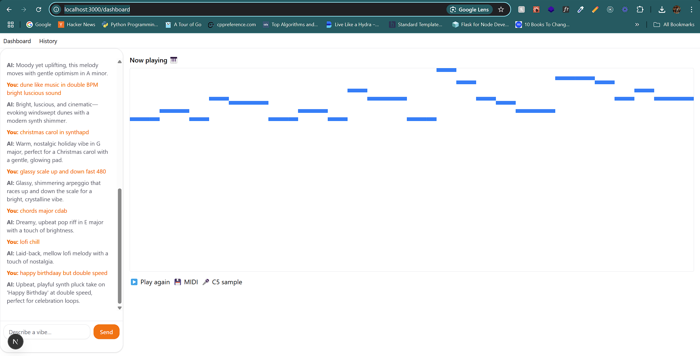

# 🎹 LLM-Composer

Generate, **hear**, and **see** fresh four-bar melodies just by _describing a vibe_ in chat.  
Built with **Next.js 15**, **React 19**, **TypeScript**, and **Tone.js**.

## Author's Note

For the most part I made this to learn how nextjs works and how I can build an ai workflow with wordware. follow the generic   `pnpm install` and `pnpm dev` commands to get started. I have not added any extra features or anything like that. I just wanted to see how the whole thing works. 

the interface is very simple and easy to use. url should be `http://localhost:3000/dashboard` after running the above commands.

I tried exporting midi and sound and creating a real song from it in a DAW turns out it works pretty well. I used FL Studio to create a song from it. I will be adding a video of the same in the future. It does need tweaking and some extra work but it is a good start. 

## [SONG on Soundcloud](https://on.soundcloud.com/HtZ3oGpd6uEYyf2x7) 

The melody and bassline notes were created from this app and then tweaked and mixed.

Working Demo looks like this: 

(THIS README WAS AUTOGENERATE BEYOND THIS POINT BY GPT-4 in a HURRY)


---

## ✨ Features

|                             | What it does                                                                          |
| --------------------------- | ------------------------------------------------------------------------------------- |
| 💬 **Chat-driven creation**  | Type a style prompt (“lo-fi chill in D♭”) &rarr; LLM returns a quantised melody JSON. |
| 🔊 **Instant playback**      | Melody is mapped to Tone.js events and played with a selectable synth preset.         |
| 🎹 **Piano-roll visualiser** | Notes render in a lightweight SVG roll that scrolls in time.                          |
| 💾 **One-click MIDI export** | Save the generated loop and drop it into any DAW.                                     |
| 🔁 **History panel**         | Scroll back through every prompt/response and replay any idea.                        |

---

## 🚀 Quick start

```bash
git clone https://github.com/Kaushal1011/LLM-Music-Composer.git
cd LLM-Music-Composer

pnpm install            # or npm i / yarn
cp .exampleenv .env     # add your keys (see below)
pnpm dev                # http://localhost:3000
````

> **Node ≥ 18** is recommended (Next 14′s minimum).

---

## 🔑 Environment variables

| Key                | Purpose                                             |
| ------------------ | --------------------------------------------------- |
| `WORDWARE_API_KEY` | Auth token for the Wordware LLM endpoint.           |
| `APP_ID`           | Wordware application-ID you created for your model. |

APP_ID for my own workflow that generated the melody is `9841a2bd-2263-49ea-b96d-9500bb48350b`.


You can generate both inside your Wordware dashboard.

---

## 📂 Project layout (Approximate)

```
.
├─ .next/               # Build output (auto-generated)
├─ app/                 # Next.js 14 App-router pages & routes
│  ├─ layout.tsx        # Root layout – providers & fonts
│  └─ page.tsx          # Chat + piano-roll UI
├─ components/          # Re-usable UI pieces
│  ├─ chat/             # ChatLog, ChatInput
│  └─ visualizer/       # PianoRoll renderer
├─ lib/
│  ├─ melodyPrompt.ts   # System prompt & guardrails for the LLM
│  ├─ toneMapper.ts     # JSON → Tone.Part event conversion
│  └─ playMelody.ts     # Tone.js synth factory & transport control
├─ public/              # Static assets (icons, demo GIF, …)
├─ .exampleenv          # Template env file
├─ next.config.ts       # Custom Next.js config (SWC minify + experimental opts)
├─ package.json         # Scripts & dependencies
└─ README.md            # You are here
```

---

## 🏗  How it works 

1. **Prompt** – User types a mood/genre in the chat box.
2. **LLM call** – `melodyPrompt.ts` sends a *system prompt* + user text to Wordware and expects pure JSON like:<br>`[ [0,"C4",0,1], … ]`
3. **Mapping** – `toneMapper.ts` wraps the tuples into Tone.js‐friendly `EventTuple`s.
4. **Playback** – `playMelody.ts` spins up a `PolySynth`, schedules a `Tone.Part`, and starts `Tone.Transport`.
5. **Visual** – The same tuples render as SVG blocks inside `PianoRoll.tsx` so what you hear is what you see.

---

## 📜 NPM scripts

| Command      | What it does                                  |
| ------------ | --------------------------------------------- |
| `pnpm dev`   | Run dev server with hot reload.               |
| `pnpm build` | Build for production (`.next/`).              |
| `pnpm start` | Start the compiled app (needs `build` first). |
| `pnpm lint`  | ESLint + Next linting.                        |

---

## 🚢 Deployment

Any place that runs a standard Next.js 14 build will work (Vercel, Netlify, Fly, Render, self-host).
On **Vercel**:

1. Push the repo to GitHub/GitLab.
2. Add project → import repo → *Environment Variables* → paste `WORDWARE_API_KEY`, `APP_ID`.
3. Hit **Deploy**.  Vercel detects Next.js and does the rest.

---

## 🛣  Roadmap

* Polyphonic & chord generation
* Tempo / swing controls
* Preset selector in the UI
* Download as WAV/MP3
* Persistent user accounts & cloud melody library

---

## 🤝 Contributing

Pull requests are welcome! Please:

1. Fork the repo, create a feature branch off `main`.
2. Keep commits small and descriptive.
3. Run `pnpm lint` before opening the PR.

---

## 📄 License

MIT — do what you want, just keep the header.

---

> Happy composing! 🎧


This is a [Next.js](https://nextjs.org) project bootstrapped with [`create-next-app`](https://nextjs.org/docs/app/api-reference/cli/create-next-app).

## Getting Started

First, run the development server:

```bash
npm run dev
# or
yarn dev
# or
pnpm dev
# or
bun dev
```

Open [http://localhost:3000](http://localhost:3000) with your browser to see the result.

You can start editing the page by modifying `app/page.tsx`. The page auto-updates as you edit the file.

This project uses [`next/font`](https://nextjs.org/docs/app/building-your-application/optimizing/fonts) to automatically optimize and load [Geist](https://vercel.com/font), a new font family for Vercel.

## Learn More

To learn more about Next.js, take a look at the following resources:

- [Next.js Documentation](https://nextjs.org/docs) - learn about Next.js features and API.
- [Learn Next.js](https://nextjs.org/learn) - an interactive Next.js tutorial.

You can check out [the Next.js GitHub repository](https://github.com/vercel/next.js) - your feedback and contributions are welcome!

## Deploy on Vercel

The easiest way to deploy your Next.js app is to use the [Vercel Platform](https://vercel.com/new?utm_medium=default-template&filter=next.js&utm_source=create-next-app&utm_campaign=create-next-app-readme) from the creators of Next.js.

Check out our [Next.js deployment documentation](https://nextjs.org/docs/app/building-your-application/deploying) for more details.
